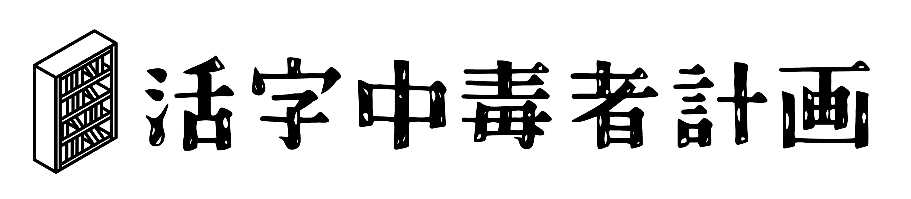

# 小佐田雄宇 / Osada Yu / osad-sakana

Hello, I'm **Osada Yu (小佐田雄宇)**. I primarily focus on **Web Development**, using technologies such as **PHP (Laravel)** and **Python (Django, FastAPI)** to build efficient and practical web applications. In addition, I am active as a **composer**, developing applications that assist with music production and streamline work processes. I also work as a programming instructor for youth, dedicating myself to nurturing the next generation of tech talent. Recently, I have been actively exploring cutting-edge technologies such as generative AI.

こんにちは、私は**Web開発**を中心に活動しているエンジニアです。主に**PHP (Laravel)** や **Python (Django, FastAPI)** を用いて、効率的で実用的なWebアプリケーションの開発に取り組んでいます。さらに、**作曲家**としても活動しており、音楽制作を補助するアプリケーションの開発や業務効率化アプリに強い興味を持っています。また、青少年向けのプログラミング講師として、次世代の技術者育成にも努めています。最近は、生成AIなどの最新技術も積極的に活用しています。

---

## Skills & Tools / スキル・ツール

### Programming Languages & Frameworks / プログラミング言語 & フレームワーク

### Tools / ツール

---

## Interests & Fields of Activity / 興味・活動分野

- Development of productivity and automation apps / 業務効率化アプリの開発
- Development of applications that assist in music production / 音楽制作を補助するアプリケーションの開発
- Teaching programming to youth / 青少年向けのプログラミング講師としての活動
- Development of new products utilizing generative AI / 生成AIを活用した新しいプロダクトの開発

## Future Goals / 今後の目標

I aim to leverage GitHub to drive projects that deliver new value in both web development and music production support.

GitHubを活用して、Web開発と音楽制作支援の両面から新しい価値を提供するプロジェクトを進めていきたいと考えています。

## Contact & More / 連絡先・その他

### Podcast 活字中毒者計画

