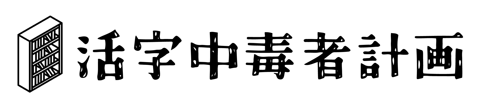

# 小佐田雄宇 / Osada Yu / osad-sakana

📍 Location: Tokyo, Japan

Hello, I'm **Osada Yu (小佐田雄宇)**, a multi-disciplinary developer and educator based in Tokyo. I specialize in **Web Development** using **PHP (Laravel)** and **Python (Django, FastAPI)** to create practical solutions spanning from AI-powered productivity tools to educational applications. As a **composer** and **programming instructor**, I bridge the gap between technology and creativity, developing tools that enhance both music production workflows and programming education for youth.

こんにちは、東京を拠点とする**Web 開発**エンジニア・プログラミング講師の**小佐田雄宇**です。**PHP (Laravel)** や **Python (Django, FastAPI)** を用いて、AI を活用した生産性向上ツールから教育アプリケーションまで、実用的なソリューションを開発しています。**作曲家**・**プログラミング講師**として、テクノロジーと創造性を融合し、音楽制作ワークフローと青少年向けプログラミング教育の両方を支援するツールを開発しています。

## Skills & Tools / スキル・ツール

### Programming Languages / プログラミング言語

### Frameworks / フレームワーク

### Tools / ツール

### Language Stats / 言語比率

## Featured Projects / 主要プロジェクト

### 🤖 AI & Productivity Tools

- **[face_classifier](https://github.com/osad-sakana/face_classifier)** - Intelligent photo sorting system using face recognition _(Python)_
- **[voicenote](https://github.com/osad-sakana/voicenote)** - Local voice recording, transcription, and export tool _(Python)_
- **[sentei-pictures](https://github.com/osad-sakana/sentei-pictures)** - Photo selection support tool _(Python)_
- **[aicloner](https://github.com/osad-sakana/aicloner)** - Directory management tool for parallel coding CLI execution _(Rust)_
- **[web-image-optimizer](https://github.com/osad-sakana/web-image-optimizer)** - Batch image compression script for web publishing _(Python)_

### 🎵 Music & Creative Tools

- **[groovepush2](https://github.com/osad-sakana/groovepush2)** - High-speed backup tool for music producers _(Rust)_
- **[groovepush](https://github.com/osad-sakana/groovepush)** - Git-style music file management tool _(Go)_
- **[podcast-recorder](https://github.com/osad-sakana/podcast-recorder)** - Professional podcast voice recorder with full-screen highlight features _(TypeScript)_
- Music production assistance applications (private repositories)

### 🔧 Developer Tools

- **[kururi-dev-browser](https://github.com/osad-sakana/kururi-dev-browser)** - Browser for developers _(TypeScript)_
- **[laravel-log-viewer](https://github.com/osad-sakana/laravel-log-viewer)** - VSCode extension for filtering and viewing Laravel logs _(TypeScript)_
- **[python-indent-visualizer](https://github.com/osad-sakana/python-indent-visualizer)** - VSCode extension for visualizing Python indent structure as nested blocks _(TypeScript)_
- **[swipefeed](https://github.com/osad-sakana/swipefeed)** - Personal RSS feed app _(TypeScript)_
- **[sshportal](https://github.com/osad-sakana/sshportal)** - SSH connection management tool for macOS _(Rust)_
- **[kururi-compiler](https://github.com/osad-sakana/kururi-compiler)** - Custom programming language Kururi _(Rust)_

### 🎮 Educational & Game Development

- **[git-tutorial-site](https://github.com/osad-sakana/git-tutorial-site)** - Git tutorial website _(Astro)_
- **[kurari_platformer](https://github.com/osad-sakana/kurari_platformer)** - Educational platformer game co-developed with students _(Python)_
- **[inventory_practice](https://github.com/osad-sakana/inventory_practice)** - Interactive keyboard inventory switching trainer _(TypeScript)_

## Interests & Fields of Activity / 興味・活動分野

- **AI-Powered Productivity Solutions** / **AI 活用による生産性向上ソリューション**
- **Music Production Technology** / **音楽制作技術**
- **Youth Programming Education** / **青少年プログラミング教育**
- **Cross-Platform Development Tools** / **クロスプラットフォーム開発ツール**

## Future Goals / 今後の目標

I aim to leverage GitHub to drive projects that deliver new value in both web development and music production support.

GitHub を活用して、Web 開発と音楽制作支援の両面から新しい価値を提供するプロジェクトを進めていきたいと考えています。

## Contact & More / 連絡先・その他

### 🏢 紫水制作所

### 🎙️ Podcast: 活字中毒者計画

